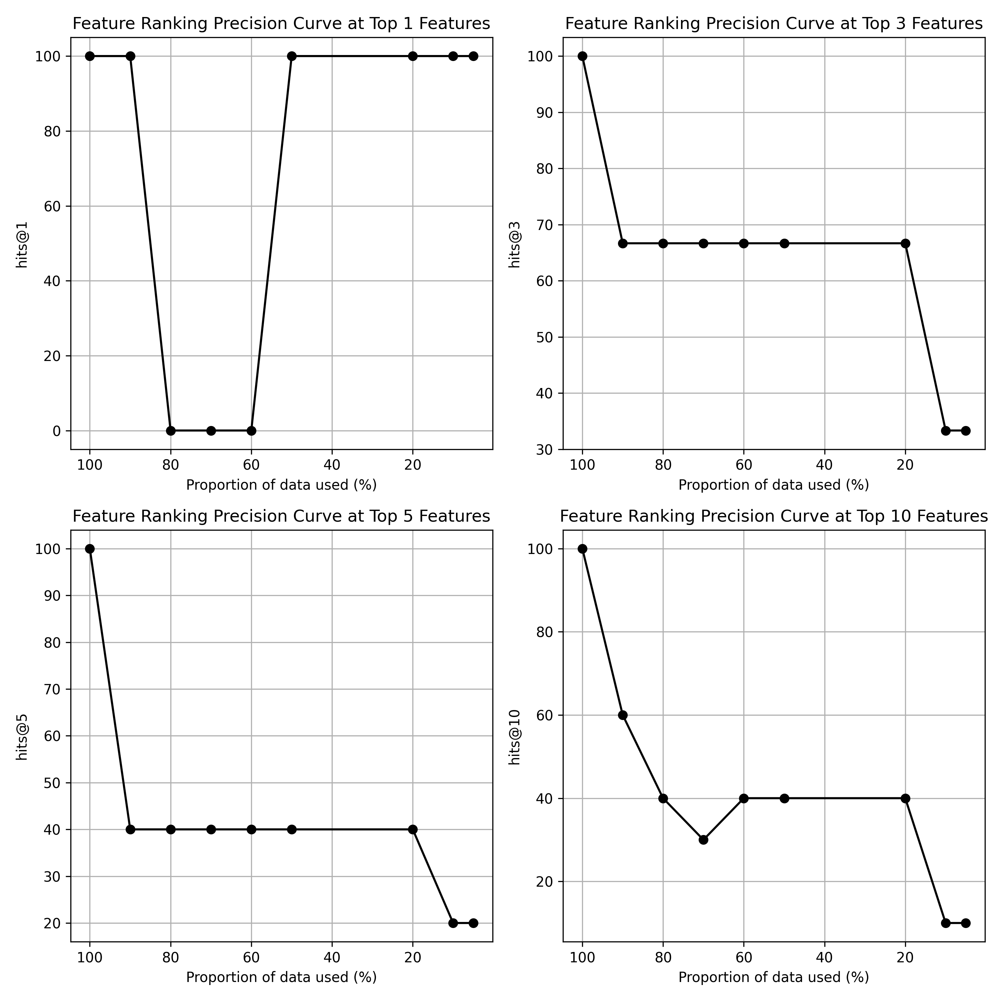

# a suite of a bit longer (regression) tests

By running `data_regression_experiment.sh`, you can conduct a stand-alone experiment that demonstrates the rankings' capability of approximating the scores obtained by using the full data set.

